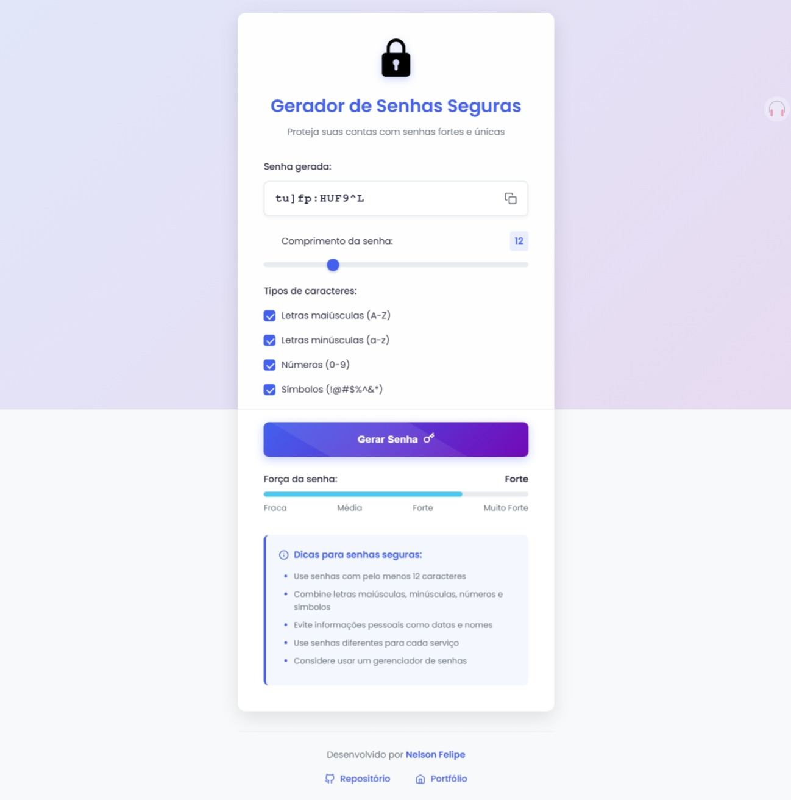

# Senhas Seguras 🔐


Um gerador de senhas seguras desenvolvido com JavaScript vanilla/puro, HTML5 e CSS3. Criado para fornecer senhas robustas e configuráveis, com feedback visual em tempo real sobre a força da senha gerada.

## 🎥 Preview



<p align="center">

  <a href="https://senhas-seguras-nf.vercel.app/"><strong>➥ Live Demo</strong></a>

</p>

## 🚀 Funcionalidades

- ✅ Geração de senhas aleatórias com até 30 caracteres
- ✅ Configuração personalizável:
  - Comprimento da senha (6-30 caracteres)
  - Inclusão de maiúsculas (A-Z)
  - Inclusão de minúsculas (a-z)
  - Inclusão de números (0-9)
  - Inclusão de símbolos (!@#$%^&*)
- ✅ Avaliação em tempo real da força da senha
- ✅ Copiar senha para área de transferência com um clique
- ✅ Interface responsiva e intuitiva
- ✅ Feedback visual imediato

## 🛠️ Tecnologias Utilizadas

- **Front-end:**
  - 
  - 
  - 

- **Princípios Aplicados:**
  - Clean Code
  - Modularização JavaScript
  - Responsividade
  - UX Básico

### Componentes Principais

- **passwordService**: Responsável pela geração de senhas aleatórias e validação de opções
- **strengthService**: Implementa a lógica de avaliação da força das senhas
- **uiService**: Gerencia as interações da interface e manipulação do DOM

## 📊 Algoritmo de Força de Senha

O cálculo da força da senha é baseado em múltiplos fatores:

- **Comprimento da senha**: Até 30 pontos (2 pontos por caractere)
- **Variedade de caracteres**: Até 40 pontos (10 pontos por tipo)
- **Caracteres únicos**: Até 30 pontos (1.5 pontos por caractere único)

A classificação da força segue os seguintes critérios:
- **Fraca**: Score < 40, ou menos de 8 caracteres, ou padrões inseguros
- **Média**: Score 40-69, mínimo 8 caracteres com combinação de tipos
- **Forte**: Score 70-89
- **Muito Forte**: Score 90+

## 🖥️ Como Executar

1. Clone o repositório:
```bash
git clone https://github.com/felipe-ssantos/senhas-seguras.git
```

2. Navegue até o diretório do projeto:
```bash
cd senhas-seguras
```

3. Abra o arquivo **index.html** em seu navegador preferido (recomendado usar Live Server no VSCode)

Ou acesse diretamente via [link da Vercel](https://senhas-seguras-nf.vercel.app/).

## 🧪 Testes

Para executar os testes unitários:

```bash
# Se você usa npm
npm test

# Se você usa yarn
yarn test
```

Os testes verificam:
- Geração correta de senhas
- Validação precisa da força
- Comportamento da interface

## 💻 Compatibilidade

- Chrome 60+
- Firefox 55+
- Safari 11+
- Edge 80+

## 🤝 Contribuição

Contribuições são bem-vindas! Para contribuir:

1. Faça um fork do projeto
2. Crie uma branch para sua feature (`git checkout -b feature/nova-funcionalidade`)
3. Commit suas mudanças (`git commit -m 'Adiciona nova funcionalidade'`)
4. Push para a branch (`git push origin feature/nova-funcionalidade`)
5. Abra um Pull Request

## 📝 Licença

Este projeto está licenciado sob a Licença MIT - veja o arquivo [LICENSE](LICENSE) para detalhes.

---
